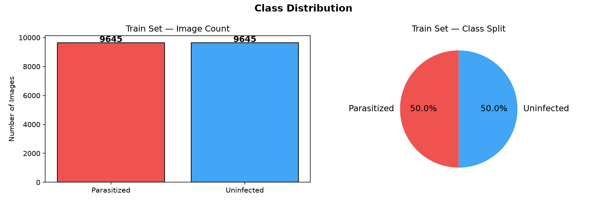
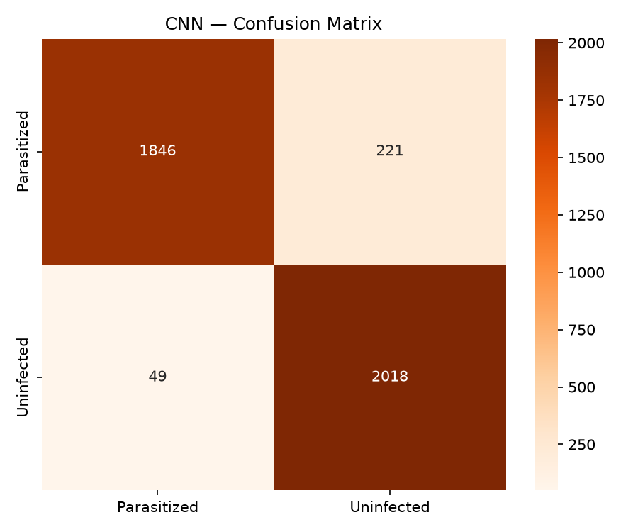
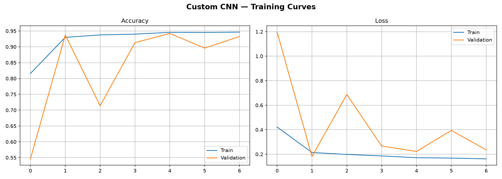
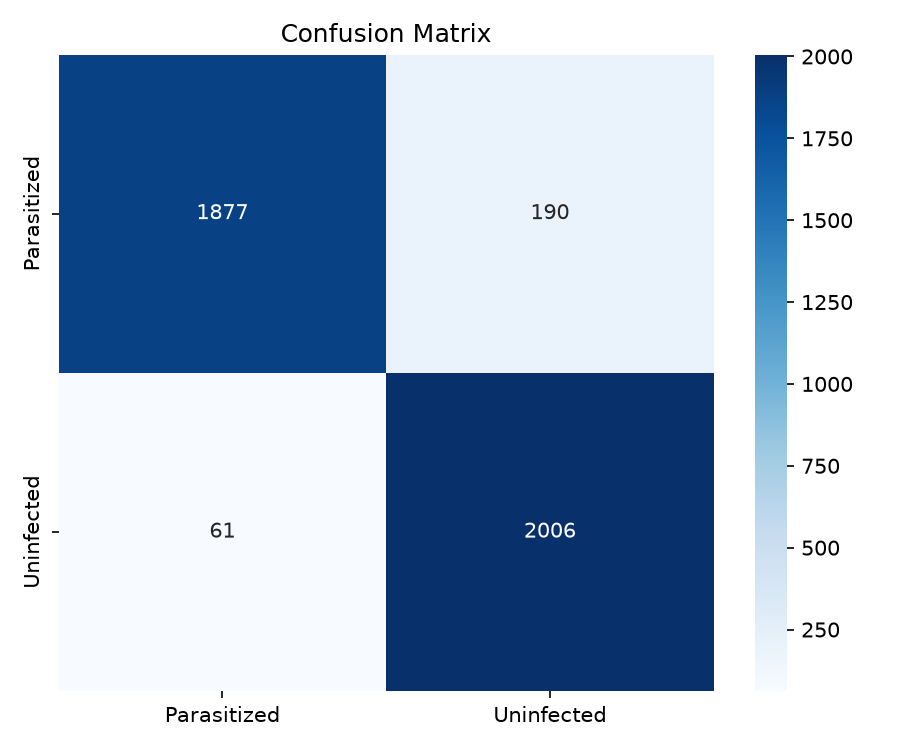
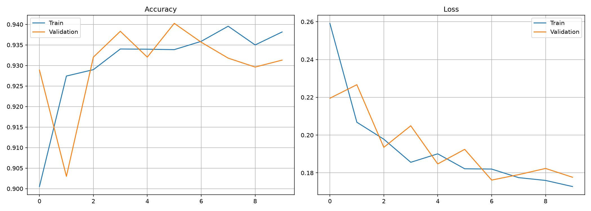

# 🦠 Malaria Detection AI

### Deep Learning-Based Malaria Cell Classification with Explainable AI

[](https://www.python.org/)
[](https://www.tensorflow.org/)
[](https://keras.io/)
[](https://www.gradio.app/)

A deep learning project that classifies microscopic blood-cell images as **Parasitized** or **Uninfected** using multiple CNN architectures.

The project compares a **Custom CNN, MobileNetV2, and ResNet50**, achieving a best test accuracy of **96.52% with ResNet50**. Grad-CAM is also used to provide visual insight into the regions influencing model predictions.

---

## 🚀 Highlights

| Feature           | Details                                                 |
| ----------------- | ------------------------------------------------------- |
| 🧠 Models         | Custom CNN, MobileNetV2, ResNet50                       |
| 🎯 Best Accuracy  | **96.52%**                                              |
| 🔬 Task           | Binary Image Classification                             |
| 🔍 Explainability | Grad-CAM                                                |
| 🖥️ Interface     | Gradio                                                  |
| 📊 Evaluation     | Accuracy, Precision, Recall, F1-score, Confusion Matrix |
| ⚖️ Dataset        | Balanced Parasitized / Uninfected classes               |

---

## 📊 Model Performance

| Model           | Test Accuracy | Parameters |
| --------------- | ------------: | ---------: |
| Custom CNN      |        95.74% |    110,785 |
| MobileNetV2     |        94.19% |  3,732,801 |
| 🏆 **ResNet50** |    **96.52%** | 25,947,265 |

### 🏆 Best Model — ResNet50

ResNet50 achieved the highest test accuracy of **96.52%** among the evaluated models.

The model also achieved approximately **97% overall accuracy** in the reported classification evaluation.

---

## 🔬 Explainable AI

The project uses **Grad-CAM (Gradient-weighted Class Activation Mapping)** to visualize the regions of a microscopic cell image that contribute to the model's prediction.

This makes the model's decision-making easier to inspect instead of relying only on the final classification output.

---

## 📌 Overview

Malaria is a serious disease caused by *Plasmodium* parasites. This project explores the use of deep learning for automatically classifying microscopic blood-cell images into **Parasitized** and **Uninfected** categories.

The goal is to compare different CNN architectures and investigate the effectiveness of both lightweight and deeper models for this image-classification task.

> ⚠️ **Educational Disclaimer:** This project is intended for educational and research purposes only. It is not a clinical diagnostic system and should not be used for medical diagnosis or treatment decisions.


---

## 🎯 Objectives

* Build an image classification system for malaria cell images.
* Preprocess and organize microscopic cell images.
* Train multiple CNN-based architectures.
* Compare their classification performance.
* Evaluate models using accuracy and classification metrics.
* Generate confusion matrices and training curves.
* Use Grad-CAM for model interpretability.
* Provide an interactive prediction interface using Gradio.

---

## 📊 Dataset

The dataset contains microscopic blood-cell images belonging to two classes:

| Class       | Description                              |
| ----------- | ---------------------------------------- |
| Parasitized | Cells containing malaria parasites       |
| Uninfected  | Cells without detected malaria parasites |

The dataset used in this project was divided into:

| Split      | Parasitized | Uninfected |  Total |
| ---------- | ----------: | ---------: | -----: |
| Training   |       9,645 |      9,645 | 19,290 |
| Validation |       2,067 |      2,067 |  4,134 |
| Testing    |       2,067 |      2,067 |  4,134 |

The dataset is balanced with a **1:1 class ratio**.

The dataset itself is excluded from this repository through `.gitignore`.

---

## 🔄 Data Preprocessing

The image pipeline includes preprocessing steps required for training the neural networks.

The project handles:

* Image loading
* Image resizing
* Normalization
* Dataset splitting
* Batch generation
* Data augmentation where applicable

The balanced dataset results in equal class weights for the training process.

---

## 🧠 Models

### 1. Custom CNN

A lightweight convolutional neural network was developed specifically for this classification task.

**Test Accuracy: 95.74%**

**Parameters:** 110,785

The custom CNN achieved strong performance while using significantly fewer parameters than the transfer-learning models.

---

### 2. MobileNetV2

MobileNetV2 is a lightweight architecture designed for efficient image classification.

**Test Accuracy: 94.19%**

**Parameters:** 3,732,801

Although MobileNetV2 is considerably smaller than ResNet50, it achieved the lowest test accuracy among the three models in this experiment.

---

### 3. ResNet50

ResNet50 is a deeper convolutional architecture that uses residual connections to improve the training of deep neural networks.

**Test Accuracy: 96.52%**

**Parameters:** 25,947,265

ResNet50 achieved the best test performance among the evaluated models.

---

## 📈 Model Comparison

| Model        | Test Accuracy |     Parameters |
| ------------ | ------------: | -------------: |
| Custom CNN   |        95.74% |        110,785 |
| MobileNetV2  |        94.19% |      3,732,801 |
| **ResNet50** |    **96.52%** | **25,947,265** |

### 🏆 Best Model

**ResNet50 — 96.52% test accuracy**

ResNet50 provided the highest classification accuracy in this experiment.

However, accuracy alone does not determine whether a model is suitable for real-world medical use. Additional validation, clinical testing, robustness analysis, and expert evaluation would be required.

---

## 🔍 Model Evaluation

The project evaluates the trained models using:

* Accuracy
* Precision
* Recall
* F1-score
* Confusion matrix
* Training/validation curves

For the final ResNet50 model, the classification results were approximately:

| Class       | Precision | Recall | F1-score |
| ----------- | --------: | -----: | -------: |
| Parasitized |      0.98 |   0.95 |     0.96 |
| Uninfected  |      0.95 |   0.98 |     0.97 |

**Overall Accuracy: ~97%**

---

## 📊 Results

### Class Distribution



### CNN Confusion Matrix



### CNN Training Curves



### Model Confusion Matrix



### Training Curves



---

## 🔬 Grad-CAM Explainability

To improve interpretability, **Gradient-weighted Class Activation Mapping (Grad-CAM)** is applied to the ResNet50 model.

Grad-CAM generates a heatmap showing the image regions that contribute most to the model's prediction.

This provides a visual way to investigate whether the model is focusing on meaningful regions of the microscopic cell image.

The final convolutional layer used for the Grad-CAM analysis is:

```text
resnet_last_conv
```

---

## 🖥️ Interactive Interface

The project includes an interactive **Gradio** interface for image prediction.

The interface allows a user to:

1. Upload a microscopic blood-cell image.
2. Pass the image through the trained model.
3. Receive the predicted class.
4. View the model's prediction output.

The interface is intended for demonstration and educational purposes.

---

## ⚙️ Installation

### 1. Clone the repository

```bash
git clone https://github.com/Rajat-91/Malaria-Detection-AI.git
cd Malaria-Detection-AI
```

### 2. Create a virtual environment

```bash
python -m venv venv
```

Activate it on Windows:

```bash
venv\Scripts\activate
```

### 3. Install dependencies

```bash
pip install -r requirements.txt
```

### 4. Open the notebook

Open:

```text
Malaria_Detection.ipynb
```

using Jupyter Notebook or VS Code.

### 5. Run the notebook

Run the notebook cells to:

* Load the dataset
* Preprocess images
* Train the models
* Evaluate the models
* Generate visualizations
* Run Grad-CAM
* Launch the Gradio interface

---

## 📁 Project Structure

```text
Malaria-Detection-AI/
│
├── Malaria_Detection.ipynb
├── requirements.txt
├── .gitignore
│
├── class_distribution.png
├── cnn_confusion_matrix.png
├── cnn_training_curves.png
├── confusion_matrix.png
└── training_curves.png
```

The dataset and trained model files are intentionally excluded from the repository.

---

## 🛠️ Technologies Used

* Python
* TensorFlow
* Keras
* NumPy
* Pandas
* Matplotlib
* Scikit-learn
* OpenCV
* Gradio
* CNN
* MobileNetV2
* ResNet50
* Grad-CAM

---

## 🚀 Key Features

* Binary malaria cell classification
* Multiple CNN architectures
* Transfer learning with MobileNetV2 and ResNet50
* Custom CNN implementation
* Model comparison
* Confusion matrix analysis
* Training/validation visualization
* Grad-CAM explainability
* Interactive Gradio interface

---

## 📌 Limitations

This project has several limitations:

* The model is trained on a specific image dataset and may not generalize to different microscopy conditions.
* Performance on the experimental test set does not guarantee real-world clinical performance.
* The project does not replace laboratory testing or professional medical diagnosis.
* Further testing on independent datasets would be required to assess generalization.
* Clinical deployment would require extensive validation and regulatory approval.

---

## 🔮 Future Improvements

Possible improvements include:

* Testing on external datasets.
* Improving image preprocessing and augmentation.
* Hyperparameter optimization.
* Comparing additional architectures.
* Improving the Gradio interface.
* Adding prediction confidence visualization.
* Performing more detailed error analysis.
* Deploying the model as a web application.
* Optimizing the model for faster inference.

---

## 👨‍💻 Author

**Rajat Sharma**

Computer Engineering Student
Thapar Institute of Engineering & Technology

GitHub: [Rajat-91](https://github.com/Rajat-91)

---

## ⚠️ Disclaimer

This project is intended solely for educational and research purposes. The predictions produced by this system should not be interpreted as medical advice, diagnosis, or treatment recommendations.
